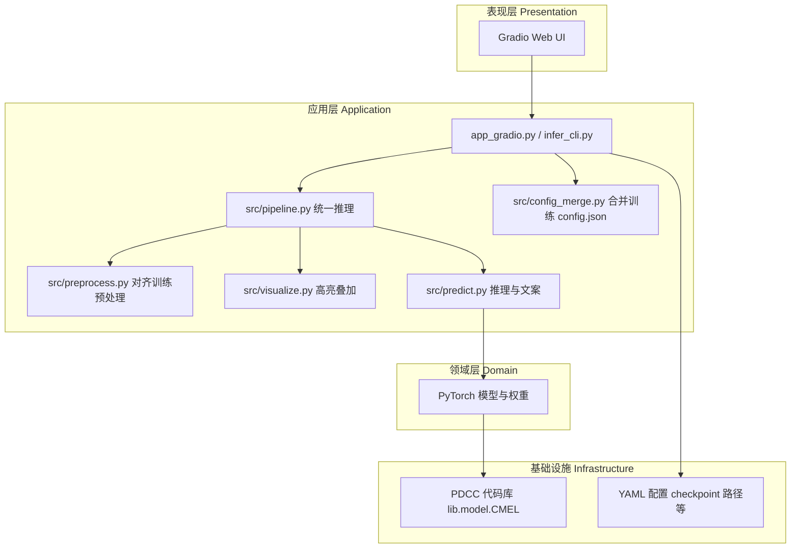

# 系统架构说明（可用于毕业论文「系统设计与实现」章节）

## 1. 总体目标

在本地或局域网内提供轻量级 Web 界面：用户上传 **原图** 与 **分割掩膜**，系统完成与训练管线一致的预处理，调用已训练的 `ImageBaseClusterDistancePlusGatingModel`（PDCC 工程内定义）进行前向推理，并输出 **目标区域可视化** 与 **预测类别**（不向用户展示概率数值）。

## 2. 逻辑分层

- **表现层**：Gradio 负责表单、图像上传、结果展示；可替换为 FastAPI + 前端而不改核心推理代码。
- **应用层**：`preprocess` 与 CEUS 数据集 Resize/Pad 策略对齐；`visualize` 仅用于展示；`predict` 封装 `softmax` 与阈值文案。
- **领域层**：模型结构、聚类门控、专家头均在 PDCC 中实现，本项目不复制模型代码，仅通过 `sys.path` 引用。
- **基础设施**：权重路径、`image_size`、`input_mode` 等由 YAML 配置，便于实验记录与论文复现。

## 3. 数据流（单次推理）

1. 用户上传 `original.png`、`mask.png`。
2. `preprocess_pair`：转灰度 → 与掩膜对齐尺寸 → Pad/Resize 到 `image_size`（默认 256，与 `CEUSDataset` 默认一致）。
3. `input_mode == masked`：`x = gray * mask`；`full`：仅用灰度图（与当前 `PDCC/main.py` 中 `model(batch['image'])` 一致）。
4. `x` 形状 `(1, 1, H, W)`，与 `in_chan=1` 的 ResNeXt 编码器一致。
5. 推理内部对 `output` 取 `argmax` 得预测类别；界面与导出 JSON 仅展示类别名 / 索引。
6. `highlight_region` 在用户原图分辨率上叠加半透明颜色（掩膜缩放对齐），与模型输入独立。

## 4. 与训练代码的一致性说明（论文中建议写明）

更完整的「CMEL 多模态 vs ImageBase 纯图像、`img_size`、归一化」对照见 **`docs/TRAINING_ALIGNMENT.md`**。

- 权重来自 `model_best.pth.tar`，加载后强制 `model.if_init = True`，避免未初始化队列分支。
- **`training_config_json`**：`src/config_merge.py` 可读取训练输出目录下的 `config.json`，在 `sync_image_size_from_training_json: true` 时自动同步 **`img_size` → `image_size`**，减少与 `validate` 不一致的风险。
- **重要**：`PDCC/lib/dataset/ceus.py` 虽计算了 `masked_image`，但 `PDCC/main.py` 训练/验证当前传入的是 `batch['image']`（整幅灰度图）。若论文叙述为「原图×掩膜输入网络」，应在正文中说明已切换为 `masked` 模式并完成再训练与验证；否则部署时可尝试将 `input_mode` 设为 `full` 并与验证集对数。

## 5. 无 GPU / 无 PyTorch 的部署选项

| 场景 | 做法 |
|------|------|
| 无 GPU，有 CPU | `backend: torch` 且 `device: cpu`；或 **`backend: onnx` + onnxruntime（CPUExecutionProvider）**。 |
| 无 PyTorch | 在开发机运行 **`export_onnx.py`**，将 **`ImageBaseInferenceWrapper`** 导出为 ONNX；部署机 **`requirements-onnx-runtime.txt`** + `config.yaml` 中 **`backend: onnx`**。完整原始 `forward` 含队列/KMeans，**不整图导出**；部署用子图与 eval 下融合 logits 主路径一致，见 **`--verify`**。 |

**可执行文件**：见 **`docs/PACKAGING.md`** 与 **`packaging/trg_app.spec`**（PyInstaller，实验性；Torch 后端体积极大，推荐 ONNX 后再打包）。

**结论**：「完全无 torch 的推理机」可行，前提是先完成 ONNX 导出与对齐；**导出**仍需要一次具备 PyTorch 的环境。

## 6. 合规与伦理（论文建议单独小节）

- 系统输出为 **辅助信息**，界面与文档中应明确 **非诊断、非治疗建议**。
- 阈值 `surgery_recommend_if_positive_prob_above` 仅用于演示，临床使用需前瞻性验证与机构伦理审批。

## 7. 扩展为正式医疗软件时的典型增量

- 用户认证、审计日志、版本化模型与配置。
- DICOM 支持、PACS 对接。
- 模型 CI：固定测试集回归（AUC、校准曲线）。
- 容器化（Docker）与 HTTPS 反向代理。
